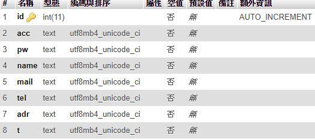

# 建立資料庫

## 管理員
新增 `admin` 資料表，儲存管理員資料  
我的權限是設計成陣列，格式為 `$permit[] = 管理項目`  
然後用 `in_array()` 去判斷管理項目有沒有權限  
以下是管理項目對應的編號  

1. 商品分類與管理
2. 訂單管理
3. 會員管理
4. 頁尾版權區管理
5. 最新消息管理

在建立資料表時順便建立預設帳號密碼  
可以先寫個簡單的php來知道序列化後的權限陣列字串  

```php
<?php 
    // 預設帳號的權限
    $permit = array(1,2,3,4,5);
    echo serialize($permit);
?>
```

- `id` 為AUTO\_INCREMENT的流水號
- `acc` 為帳號
- `pw` 為密碼
- `permit` 為管理員權限，將陣列序列化後存入

  
  

## 商品分類
新增 `cat` 資料表，儲存商品分類  
順便新增好各商品分類  

- `id` 為AUTO\_INCREMENT的流水號
- `name` 為分類名稱
- `parent` 為所屬大分類ID，若為0則是大分類

  
  

## 頁尾版權
新增 `foot` 資料表，儲存頁尾版權    

- `foot` 為頁尾版權
  
  
  

## 商品
新增 `item` 資料表，儲存商品資料  

- `id` 為AUTO\_INCREMENT的流水號
- `name` 為商品名稱
- `price` 為商品價格
- `file` 為商品圖片
- `c1` 為大類ID
- `c2` 為中類ID
- `qt` 為庫存量
- `type` 為規格
- `text` 為商品說明
- `sell` 為是否上架

  
  

## 訂單
新增 `ord` 資料表，儲存訂單資料  

- `id` 為AUTO\_INCREMENT的流水號
- `user` 為使用者ID
- `item` 為訂單內容
- `time` 為下訂時間

  
  

## 使用者
新增 `user` 資料表，儲存使用者資料  

- `id` 為AUTO\_INCREMENT的流水號
- `acc` 為帳號
- `pw` 為密碼
- `name` 為名稱
- `mail` 為信箱
- `tel` 為電話
- `adr` 為地址
- `t` 為註冊日期

  
  
